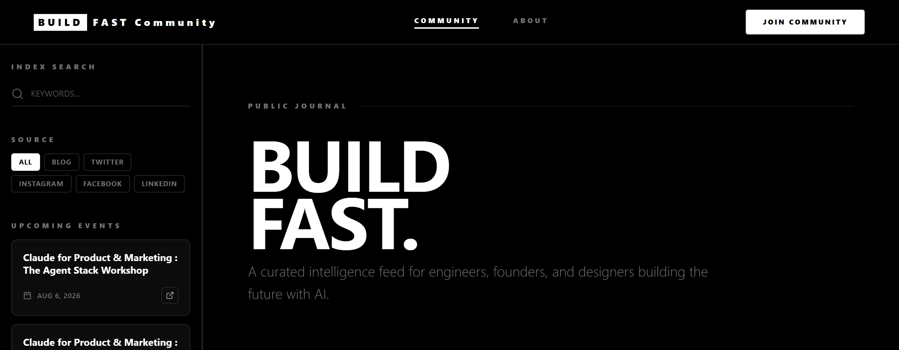
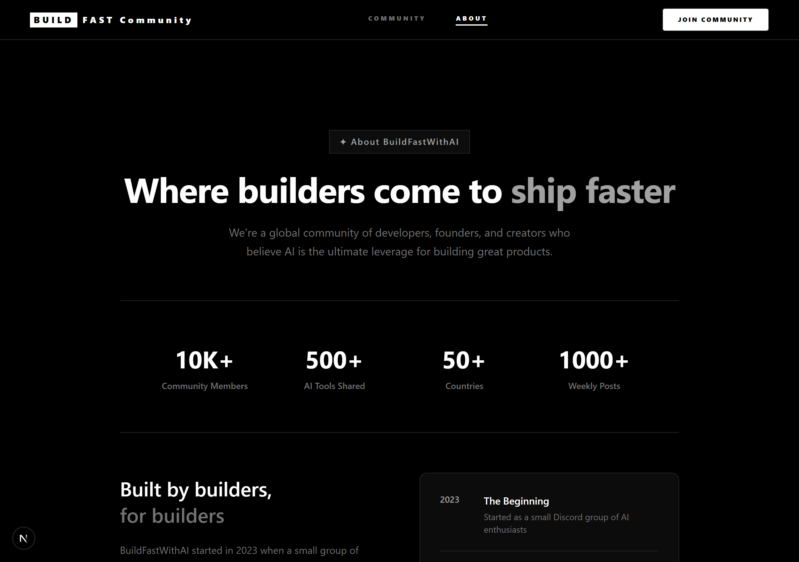

<div align="center">

# BuildFast Community

### A production-ready community feed for AI builders — one place where curated social posts and long-form articles live together, with Google login, likes, and threaded comments.

Drop-in **Next.js 16 + Supabase** starter. No proprietary services, no lock-in — clone it, point it at your own Supabase project, and you have a working community platform in about five minutes.

</div>

<div align="center">



</div>

---

## Why this exists

Every builder community ends up scattered — insights buried in Twitter threads, tools lost in Discord scroll-back, articles on five different blogs. This is the opposite: a **single feed** that merges "someone shared a link" and "someone wrote a full post" into one chronological stream, so the good stuff has one home.

It's also a genuinely useful reference implementation of the patterns people keep getting wrong in the App Router:

- **Cookie-based Supabase auth** that survives server components, server actions, and API routes — no `localStorage` tokens, no hydration flashes.
- **A popup Google OAuth flow** that updates the opener tab's React state without a full reload.
- **Server Actions as the primary data layer**, with thin REST routes only where the browser genuinely needs an HTTP endpoint.

If you're building anything with Supabase Auth on Next.js 16, the `src/utils/supabase/` + `src/actions/` split here is worth stealing on its own.

## What's inside

| | |
|---|---|
| **Unified feed** | Social link-posts + long-form text posts, merged and sorted newest-first ([`posts.actions.ts`](src/actions/posts.actions.ts)) |
| **Auto link previews** | Social posts store only a URL; og:image / title / description are resolved on the fly ([`link-preview.actions.ts`](src/actions/link-preview.actions.ts)) |
| **Google auth (popup)** | Supabase OAuth, session in HTTP-only cookies ([`useAuth.ts`](src/hooks/useAuth.ts)) |
| **Likes & threaded comments** | Auth-gated, one-per-user likes and nested replies on text posts ([`likes-comments.actions.ts`](src/actions/likes-comments.actions.ts)) |
| **Filtering & search** | By platform (Twitter / LinkedIn / Instagram / Blog…) and free-text, all client-side `useMemo` |
| **Events sidebar** | Optional [Luma](https://lu.ma) integration for live community events |
| **Design** | A sharp black-and-white editorial aesthetic, Tailwind CSS v4, Framer Motion, fully responsive |

<div align="center">



</div>

## Use it

### Prerequisites

- Node 18.18+ and npm
- A free [Supabase](https://supabase.com) project (Auth + Postgres)

### 1. Clone and install

```bash
git clone https://github.com/<your-org>/buildfast-community.git
cd buildfast-community
npm install
```

### 2. Configure environment

```bash
cp .env.example .env.local
```

Fill in your Supabase URL and anon key (Supabase → Project Settings → API). The Luma keys are optional — leave them blank to disable the events sidebar.

### 3. Set up the database

Run this once in the Supabase SQL editor. It creates the tables the app reads and writes, with Row Level Security so the anon key is safe to ship to the browser:

```sql
-- Social link-posts shown in the feed
create table community_posts (
  id           bigint generated always as identity primary key,
  post_type    text not null check (post_type in ('linkedin','instagram','twitter','x','blog')),
  link         text not null,
  author_name  text not null,
  author_email text,
  created_at   timestamptz not null default now(),
  updated_at   timestamptz not null default now()
);

-- Long-form / blog-style posts
create table community_text_posts (
  id         bigint generated always as identity primary key,
  title      text not null,
  excerpt    text,
  content    text not null,           -- HTML
  image_url  text,
  image_path text,
  published  boolean not null default false,
  views      integer not null default 0,
  slug       text unique,
  created_at timestamptz not null default now()
);

-- One like per user per text post
create table community_text_post_likes (
  id           bigint generated always as identity primary key,
  text_post_id bigint not null references community_text_posts(id) on delete cascade,
  user_id      uuid not null references auth.users(id) on delete cascade,
  created_at   timestamptz not null default now(),
  unique (text_post_id, user_id)
);

-- Threaded comments (parent_id = null → top level)
create table community_text_post_comments (
  id           bigint generated always as identity primary key,
  text_post_id bigint not null references community_text_posts(id) on delete cascade,
  user_id      uuid not null references auth.users(id) on delete cascade,
  parent_id    bigint references community_text_post_comments(id) on delete cascade,
  content      text not null,
  author_name  text not null,
  created_at   timestamptz not null default now()
);

-- Email capture for "Join the community"
create table community_join (
  id         bigint generated always as identity primary key,
  email      text unique not null,
  created_at timestamptz not null default now()
);

-- Optional: atomic view counter. The app falls back to a plain UPDATE
-- if this function doesn't exist, so it's safe to skip.
create function increment_text_post_views(post_id bigint)
returns void language sql as $$
  update community_text_posts set views = views + 1 where id = post_id;
$$;
```

Then enable **Google** as an auth provider under Supabase → Authentication → Providers, and add `http://localhost:3000/auth/callback` to the allowed redirect URLs. Turn on RLS for each table and add policies that fit your community (public read on posts; authenticated insert on likes/comments).

### 4. Run

```bash
npm run dev
```

Open [http://localhost:3000](http://localhost:3000) — it redirects to `/community`.

## The recipe — how it's built

A quick tour so you can extend it (or borrow the parts you need):

1. **Two Supabase clients, one session.** [`utils/supabase/client.ts`](src/utils/supabase/client.ts) (browser) and [`utils/supabase/server.ts`](src/utils/supabase/server.ts) (server) both read/write the *same* HTTP-only cookies. `updateSession()` in [`utils/supabase/middleware.ts`](src/utils/supabase/middleware.ts) refreshes the session on each request. That's why a like or comment works immediately after login, with no page refresh.

2. **Server Actions are the backend.** Everything in [`src/actions/`](src/actions) starts with `"use server"` and is called directly from components — `await getAllPosts()`, `await toggleLike(id)`. User-scoped actions read the current user from cookies via the server client; anonymous reads use a plain client in [`lib/supabase.ts`](src/lib/supabase.ts).

3. **The feed is a discriminated union.** `getAllPosts()` fetches social and text posts in parallel, tags each with `type: 'social' | 'text'`, merges, and sorts by date. `FeedItem` switches on `type` to render the right card — add a new post source by extending the union.

4. **Link previews on demand.** Social posts store only a URL. `PostCard` calls `POST /api/link-preview`, which fetches the page and parses Open Graph tags, so the feed stays rich without duplicating metadata into your DB.

5. **Popup auth that talks back.** `/auth/popup` starts Google OAuth; `/auth/callback` exchanges the code for a session server-side; `/auth/callback/close` `postMessage`s the opener, and `useAuth` updates React state in place.

There's a deeper architecture writeup in [`docs/PROJECT_OVERVIEW.md`](docs/PROJECT_OVERVIEW.md).

## Tech stack

Next.js 16 (App Router, Turbopack) · React 19 · Supabase (Auth + Postgres) · Tailwind CSS v4 · Framer Motion · TypeScript · lucide-react

## Good first uses

- **Fork it into your own community** — swap the branding in `about/page.tsx` and the metadata in `layout.tsx`, point it at your Supabase, done.
- **Lift the auth setup** into another Next.js 16 project — copy `utils/supabase/` + `useAuth` + the `/auth` routes.
- **Add a post source** (RSS, a newsletter, YouTube) by adding an action and a case to the feed union.

## Contributing

PRs welcome — bug fixes, a new post source, better RLS policy examples, or docs improvements. Keep the "Server Actions first, REST only when the browser needs it" convention, and run `npm run build` before opening a PR.

> **Note:** this repo ships as a runnable end-product app, not a reusable "method," so it intentionally does **not** include a distributable agent skill — the SQL above plus the recipe are all you need to reproduce it.

## License

[MIT](LICENSE) © BuildFast with AI
